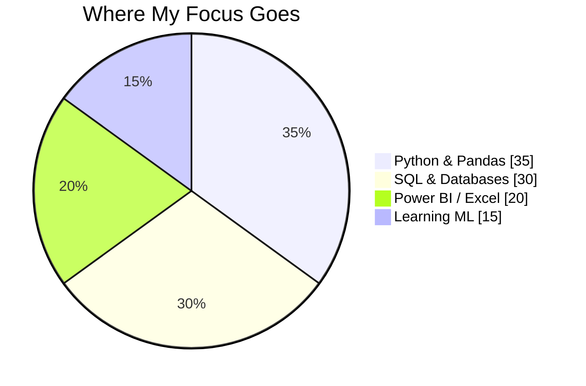

  

## 👋 About Me

ECE graduate with hands-on industry experience as an **Instrumentation Engineer** — now channeling that same precision into **data analytics**. I spend my time turning messy spreadsheets and databases into insights businesses can actually act on.

<table>
<tr>
<td width="50%" valign="top">

**🎯 Currently**
- 📊 Working across Python, SQL & Power BI
- 🔍 Sharpening EDA & statistical thinking
- 🧠 Exploring Machine Learning fundamentals
- 🤝 Open to Data Analyst / Data Science roles

</td>
<td width="50%" valign="top">

**💬 Talk to me about**
- SQL query optimization & reporting
- Python data cleaning & automation
- Power BI dashboard design
- Breaking into data from a non-CS background

</td>
</tr>
</table>

## 🧬 My Path Into Data

```mermaid
flowchart LR
    A["🎓 ECE Graduate"] --> B["⚙️ Instrumentation Engineer"]
    B --> C["🐍 Learned Python & SQL"]
    C --> D["📊 Data Analyst — Now"]
    D --> E["🚀 Data Scientist — Next"]

    style A fill:#7C3AED,color:#ffffff,stroke:#0D1117,stroke-width:2px
    style B fill:#8B5CF6,color:#ffffff,stroke:#0D1117,stroke-width:2px
    style C fill:#3B82F6,color:#ffffff,stroke:#0D1117,stroke-width:2px
    style D fill:#06B6D4,color:#0D1117,stroke:#0D1117,stroke-width:2px
    style E fill:#22D3EE,color:#0D1117,stroke:#0D1117,stroke-width:2px
```

## 🛠️ Tech Stack

  

## 📌 Featured Repositories

<table width="100%">
<tr>
<td width="50%" valign="top">

**🗄️ [SQL-Projects](https://github.com/niranjannandams99-droid/SQL-Projects)**
MySQL portfolio — queries, database design, reporting & business-focused analytics.

</td>
<td width="50%" valign="top">

**🐍 [Python-Projects](https://github.com/niranjannandams99-droid/Python-Projects)**
Data analysis, Pandas, NumPy, EDA, automation & visualization projects.

</td>
</tr>
<tr>
<td width="50%" valign="top">

**📊 [PowerBi](https://github.com/niranjannandams99-droid/PowerBi)**
Interactive dashboards, data modeling, DAX & Power Query solutions.

</td>
<td width="50%" valign="top">

**🤖 [Machine-Learning](https://github.com/niranjannandams99-droid/Machine-Learning)**
Predictive modeling, model evaluation & applied ML problem-solving.

</td>
</tr>
<tr>
<td width="50%" valign="top">

**🧠 [Deep-Learning](https://github.com/niranjannandams99-droid/Deep-Learning)**
Neural network experiments & deep learning model training workflows.

</td>
<td width="50%" valign="top">

<i>🔜 New projects added regularly</i>

</td>
</tr>
</table>

## 📈 Contribution Activity

## 🤝 Let's Connect

  

<i>"Turning data into actionable insights."</i>

