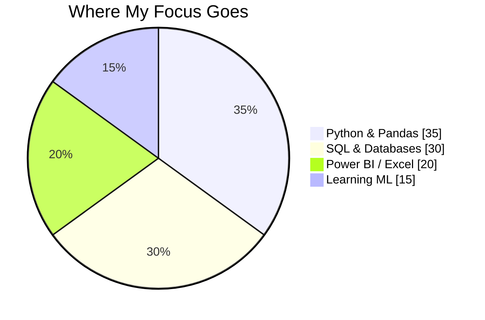

<svg width="1200" height="320" viewBox="0 0 1200 320" xmlns="http://www.w3.org/2000/svg">
  <defs>
    <linearGradient id="bg" x1="0%" y1="0%" x2="100%" y2="100%">
      <stop offset="0%" stop-color="#0B0620"/>
      <stop offset="55%" stop-color="#170B3B"/>
      <stop offset="100%" stop-color="#0B0620"/>
    </linearGradient>
    <linearGradient id="accent" x1="0%" y1="0%" x2="100%" y2="0%">
      <stop offset="0%" stop-color="#7C3AED"/>
      <stop offset="100%" stop-color="#06B6D4"/>
    </linearGradient>
    <linearGradient id="bars" x1="0%" y1="100%" x2="0%" y2="0%">
      <stop offset="0%" stop-color="#7C3AED" stop-opacity="0.85"/>
      <stop offset="100%" stop-color="#06B6D4" stop-opacity="0.55"/>
    </linearGradient>
    <radialGradient id="glow" cx="50%" cy="50%" r="50%">
      <stop offset="0%" stop-color="#7C3AED" stop-opacity="0.35"/>
      <stop offset="100%" stop-color="#7C3AED" stop-opacity="0"/>
    </radialGradient>
  </defs>

  <rect width="1200" height="320" fill="url(#bg)"/>

  <circle cx="1000" cy="90" r="220" fill="url(#glow)"/>

  <g opacity="0.35">
    <circle cx="60" cy="45" r="2" fill="#06B6D4"/>
    <circle cx="95" cy="70" r="2" fill="#7C3AED"/>
    <circle cx="40" cy="90" r="2" fill="#06B6D4"/>
    <circle cx="120" cy="40" r="2" fill="#7C3AED"/>
    <circle cx="150" cy="80" r="2" fill="#06B6D4"/>
    <circle cx="75" cy="115" r="2" fill="#7C3AED"/>
    <circle cx="20" cy="60" r="2" fill="#06B6D4"/>
  </g>

  <g transform="translate(870,110)">
    <rect x="0"   y="150" width="26" height="60"  rx="4" fill="url(#bars)"/>
    <rect x="36"  y="110" width="26" height="100" rx="4" fill="url(#bars)"/>
    <rect x="72"  y="70"  width="26" height="140" rx="4" fill="url(#bars)"/>
    <rect x="108" y="130" width="26" height="80"  rx="4" fill="url(#bars)"/>
    <rect x="144" y="40"  width="26" height="170" rx="4" fill="url(#bars)"/>
    <rect x="180" y="95"  width="26" height="115" rx="4" fill="url(#bars)"/>
    <polyline points="0,150 36,110 72,70 108,130 144,40 180,95" fill="none" stroke="#06B6D4" stroke-width="2.5" stroke-linejoin="round" stroke-linecap="round" opacity="0.9"/>
    <circle cx="144" cy="40" r="4.5" fill="#ffffff"/>
  </g>

  <rect x="90" y="78" width="70" height="6" rx="3" fill="url(#accent)"/>

  <text x="90" y="150" font-family="Segoe UI, Helvetica, Arial, sans-serif" font-size="58" font-weight="700" fill="#FFFFFF">
    Niranjan Nandam
  </text>

  <text x="90" y="192" font-family="Segoe UI, Helvetica, Arial, sans-serif" font-size="21" font-weight="600" letter-spacing="2" fill="#06B6D4">
    DATA ANALYST &#183; PYTHON &#183; SQL &#183; POWER BI
  </text>

  <text x="90" y="228" font-family="Segoe UI, Helvetica, Arial, sans-serif" font-size="16" font-style="italic" fill="#9CA3AF">
    ECE Graduate &#8594; Instrumentation Engineer &#8594; Turning data into decisions
  </text>

  <g transform="translate(90,255)">
    <rect x="0" width="150" height="30" rx="15" fill="#7C3AED" fill-opacity="0.15" stroke="#7C3AED" stroke-width="1"/>
    <text x="75" y="20" font-family="Segoe UI, Helvetica, Arial, sans-serif" font-size="13" fill="#C4B5FD" text-anchor="middle">Bangalore, India</text>
  </g>
  <g transform="translate(255,255)">
    <rect x="0" width="150" height="30" rx="15" fill="#06B6D4" fill-opacity="0.15" stroke="#06B6D4" stroke-width="1"/>
    <text x="75" y="20" font-family="Segoe UI, Helvetica, Arial, sans-serif" font-size="13" fill="#67E8F9" text-anchor="middle">Open to Work</text>
  </g>
</svg>

## 👋 About Me

ECE graduate with hands-on industry experience as an **Instrumentation Engineer** — now channeling that same precision into **data analytics**. I turn messy spreadsheets and databases into insights businesses can actually act on.

<table>
<tr>
<td width="50%" valign="top">

**🎯 Currently**
- 📊 Working across Python, SQL & Power BI
- 🔍 Sharpening EDA & statistical thinking
- 🧠 Exploring Machine Learning fundamentals
- 🤝 Open to Data Analyst / Data Science roles

</td>
<td width="50%" valign="top">

**💬 Talk to me about**
- SQL query optimization & reporting
- Python data cleaning & automation
- Power BI dashboard design
- Breaking into data from a non-CS background

</td>
</tr>
</table>

## 🧬 My Path Into Data

```mermaid
flowchart LR
    A["🎓 ECE Graduate"] --> B["⚙️ Instrumentation Engineer"]
    B --> C["🐍 Learned Python & SQL"]
    C --> D["📊 Data Analyst — Now"]
    D --> E["🚀 Data Scientist — Next"]

    style A fill:#7C3AED,color:#ffffff,stroke:#0D1117,stroke-width:2px
    style B fill:#8B5CF6,color:#ffffff,stroke:#0D1117,stroke-width:2px
    style C fill:#3B82F6,color:#ffffff,stroke:#0D1117,stroke-width:2px
    style D fill:#06B6D4,color:#0D1117,stroke:#0D1117,stroke-width:2px
    style E fill:#22D3EE,color:#0D1117,stroke:#0D1117,stroke-width:2px
```

## 🛠️ Tech Stack

  

## 📌 Featured Repositories

<table width="100%">
<tr>
<td width="50%" valign="top">

**🗄️ [SQL-Projects](https://github.com/niranjannandams99-droid/SQL-Projects)**
MySQL portfolio — queries, database design, reporting & business-focused analytics.

</td>
<td width="50%" valign="top">

**🐍 [Python-Projects](https://github.com/niranjannandams99-droid/Python-Projects)**
Data analysis, Pandas, NumPy, EDA, automation & visualization projects.

</td>
</tr>
<tr>
<td width="50%" valign="top">

**📊 [PowerBi](https://github.com/niranjannandams99-droid/PowerBi)**
Interactive dashboards, data modeling, DAX & Power Query solutions.

</td>
<td width="50%" valign="top">

**🤖 [Machine-Learning](https://github.com/niranjannandams99-droid/Machine-Learning)**
Predictive modeling, model evaluation & applied ML problem-solving.

</td>
</tr>
<tr>
<td width="50%" valign="top">

**🧠 [Deep-Learning](https://github.com/niranjannandams99-droid/Deep-Learning)**
Neural network experiments & deep learning model training workflows.

</td>
<td width="50%" valign="top">

<i>🔜 New projects added regularly</i>

</td>
</tr>
</table>

## 📈 Contribution Activity

## 🤝 Let's Connect

  

<i>"Turning data into actionable insights."</i>

